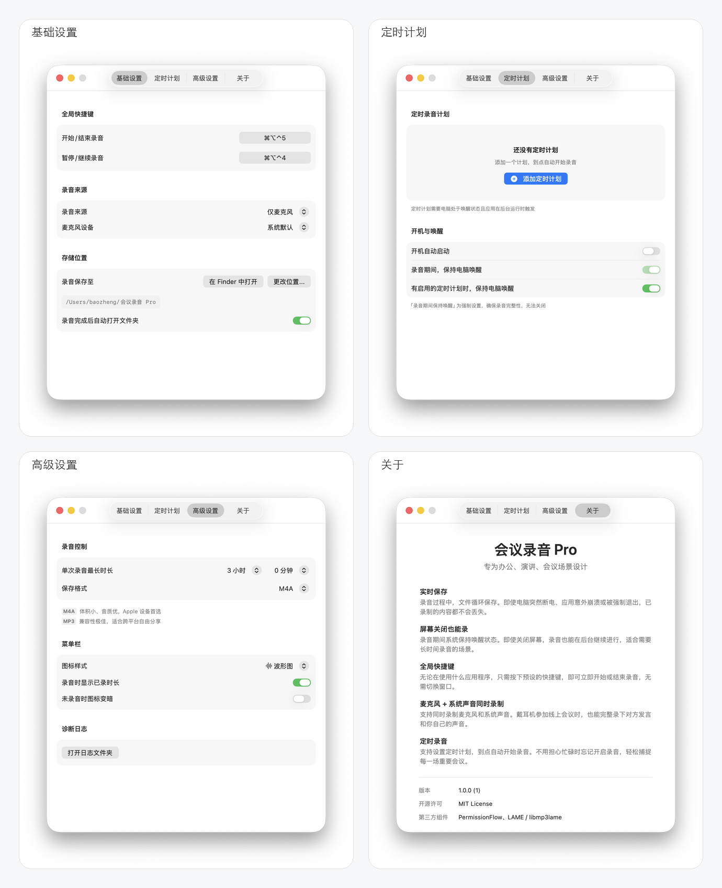
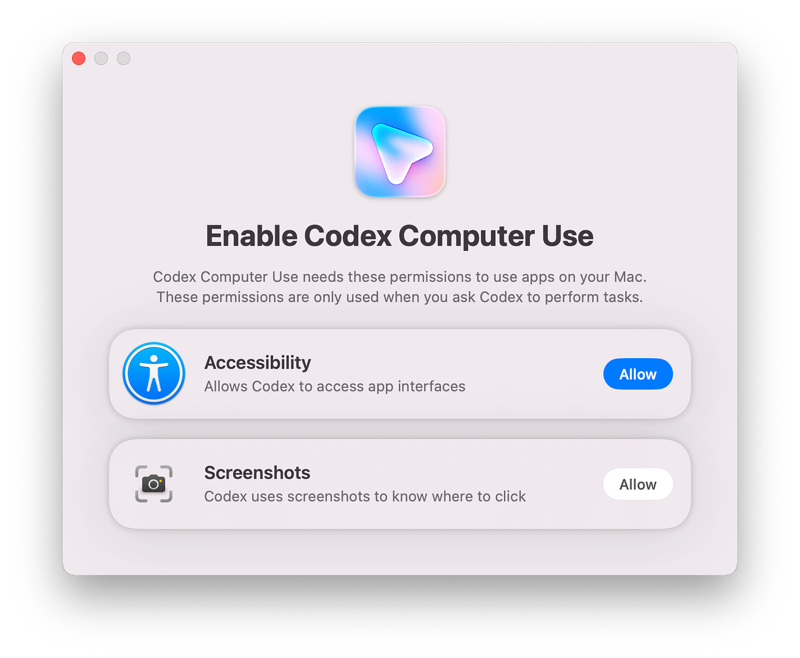

# 我用 Vibe Coding 做了一个极简 Mac 会议录音工具

## 为什么做这个工具

我最近做了个很小的 Mac 软件，叫「会议录音 Pro」。功能很单一，就是把 Mac 上开会的声音更方便、更稳地录下来，**不做转写，也不搞什么智能总结**。

这个需求我自己一直有。开会、访谈、复盘、听课，当场听着觉得都记住了，过两天再想细节，基本忘光。录音是最靠得住的原始记录，但 Mac 的语音备忘录用起来一直不太顺手。

最烦的是文件管理。语音备忘录的数据跟着 iCloud 同步，文件路径藏得很深，时间一长 iCloud 里堆了一堆录音，空间被占掉不说，想找、搬、想清理都很麻烦。

启动也慢。语音备忘录没有全局快捷键，开会时突然想录，得切应用、找窗口、点开始，很打断节奏。

还容易忘记关。开完会忙别的事情，录音就一直挂着，最后录出十几二十个小时，回头还要自己剪掉没用的部分。

线上会议是另一个大问题。现在开会大都戴耳机，语音备忘录只能录到自己说话，对方的声音在耳机里，压根没进录音文件。

所以我做了「会议录音 Pro」。它常驻菜单栏，不占 Dock，按全局快捷键就能开始录。支持三种来源：麦克风、系统声音、麦克风加系统声音——戴耳机开会时也能把两边的声音一起录进去。

另外加了几个我自己很需要的功能：最长录音时长，防止忘关；定时录音，解决固定会议容易漏录的问题；输出支持 M4A 和 MP3，前者适合本地留存，后者方便传给一些只吃 MP3 的转写服务。

文件只存在用户指定的本地目录，不需要账号，录音本身不联网，也不会传到云端。项目完全开源，想看它到底做了什么，都可以自己翻代码。

产品这部分说完了。

## Vibe Coding 过程里的几次转弯

剩下想聊的是，这个软件是我 Vibe Coding 出来的，过程里踩了不少坑。

最开始的需求真的很简单，就是想更方便地录会议。但做着做着功能就开始失控：录音做完了，想加转写；转写加了，觉得该有总结；有了总结，又想加列表；有了列表，顺手想做个日历视图看哪天录了什么。再往后导出、搜索、标签、文件管理都冒出来了。每一步单看都挺合理，凑在一起就变成一个大工程。

中途我把功能重新梳理了一遍，砍掉了大半。想法上也有点转变：AI 时代不见得所有软件都要把整条链路吃下来，录音、转写、总结、知识管理完全可以拆开，每一环用自己最顺手的工具就行。一个小工具能把其中一件事做稳，就已经够用了。所以最后「会议录音 Pro」只留下录音相关的核心能力：快速开始、双向录音、定时录音、最长时长限制、本地文件、M4A/MP3 输出、权限引导。

还有一个判断我一开始就错了：我以为录音这件事很简单。真做起来才发现里面细节不少——系统声音和麦克风的采样率可能不一致，时间轴对不上，录出来的声音就变慢、变形，甚至没法听。录音有开始、暂停、停止、收尾几个状态，临时文件和最终文件也得处理干净，音频要实时写入实时保存，最后还要确认文件能被系统识别、能正常播放。这些逻辑设计得不够细，就会出各种毛病：状态互相打架、后台一直占资源、录音存不下来，或者存下来了打不开。

这次开发我花了大量时间跟 AI 反复对代码。我会问它：这个项目有没有问题？有没有丢录音的风险？权限有没有问题？打包会不会出错？系统声音是不是真的能录到？AI 每次都能挑出点东西，也总说已经修好了。但录音软件最怕平时看不出来，关键时候出问题：录了一小时文件只有十几分钟，系统声音其实没录进去，MP3 后缀有了但文件根本打不开。光靠"能跑起来""看起来没问题"这种标准，是没办法安心的。

我意识到"能跑"这件事本身就不是一个够用的标准，它只能说明最顺利的那条路径走通了，说明不了别的路径会不会出事。这个软件的可用性到底是什么，边界在哪里，怎么才算达标。

这个问题拆开来看，其实是两件不同的事。一件是功能有没有覆盖到——麦克风录音、系统声音录音、混合录音、暂停继续、定时自动录音、MP3 转码，这些主路径必须全部跑通才能谈发布，这部分本质上是测试用例能覆盖的范围。另一件事，是要站在工程的角度去想这个东西可能会在哪里出问题：状态之间会不会冲突，资源会不会一直占着不释放，文件写到一半进程挂了会怎样，别人的机器装不上会是因为什么。这类问题不是靠"用户会怎么点"想出来的，而是要从系统实现的角度反过来推。这恰恰是纯产品经理视角很容易漏掉的部分——因为从使用者的角度出发，很难自然地想到这些工程层面的隐患。

想清楚这两件事之后，我把它们写进了项目一开始就有的 `AGENTS.md`——这份文档本来是给 AI 定编码规范的，这次我往里面加了交付标准：哪些问题是阻断级的（丢录音、文件损坏、应用打不开、DMG 装不上），哪些是常用路径必须跑通的（麦克风、系统声音、混合录音、MP3 输出、定时录音），清零到什么程度才算能发布。有了这份标准，AI 再做代码校验时，就能对着标准判断现在到底行不行，而不是靠我一遍问"你再看看还有没有问题"来推进。

标准定下来之后，测试过程也经历了一次明显的迭代。最早的做法很朴素：改完一处，自己手动点一遍，听感觉没问题就算过了。这个方式对录音软件几乎不成立——麦克风、系统声音、混合录音、暂停继续、连续录音、定时录音、权限缺失、打包产物，场景一多，人工根本测不全，也很容易漏掉刚好在边界上的情况。

后来我把测试也交给 Agent 固化下来了。项目里现在有个一键 QA 脚本 `scripts/run_full_qa.sh`，会先打出 Release 包，再用打包后的应用跑测试，覆盖设置回读、麦克风录音、暂停继续、连续录音、系统声音、混合音源、定时自动录音，还会顺带检查 DMG、签名、录音文件和日志。更关键的一步是，我还加了个可以真的用耳朵去听的专项测试：脚本会生成两段测试音频，一段当系统声音，一段当麦克风声音，分别跑三种模式录完之后，输出原始录音和增益后的试听文件。这样测试的结果不是一行"通过"，而是能被我实际听到、验证到的东西。

这个转变的意义在于，测试从"跑一遍图个心安"变成了**"跑完之后有证据摆在眼前"**。自动化把人工成本降下来了，可视化的校验方式又让这份"心安"变得有依据，不再是凭感觉。这两件事叠在一起，改代码时的心理负担明显小了很多，剩下菜单栏视觉、系统授权、设备插拔这类需要人手动交互的场景，才留给人工。

还有个小功能我做得挺满意，是权限引导。macOS 的权限设置对普通用户不太友好。录系统声音需要打开「屏幕与系统音频录制」这个权限，但系统设置里藏得很深。早期我只是跳转到设置页面完事，后来在 Codex 引导授权的体验里看到一种更清楚的做法：自动打开对应设置页，再用一个悬浮提示告诉用户该打开哪个开关。我把这个引导功能用到了软件里。现在用户选系统声音或混合录音模式时，如果还没授权，软件才会主动弹出引导。

*图源：[AI.cc 对 Codex Computer Use 的介绍](https://www.ai.cc/blogs/how-to-use-codex-openai-2026-update-computer-use-guide/)*

回头看这次做的产品，重新想明白了"可用"这个词到底该如何定义。AI 能很快地把功能写出来，能让一个东西"跑起来"，但它不会替你判断这个东西够不够可靠、边界在哪里、哪些问题必须解决才能拿出去给别人用——这件事只能自己想清楚。而这恰恰是做产品的人容易跳过的一步，站在使用者角度想需求很自然，但站在工程角度去想会在哪里出问题，需要额外的经验和判断。

「会议录音 Pro」现在就是这么个小工具，不打算接管你整个会议工作流，只管把声音本地、稳定地录下来。转写、总结、整理，用哪个软件都行，你自己定。

如果你也经常在 Mac 上开会，遇到过忘录、忘关、找不到文件、耳机会议只录到自己声音这些烦心事，可以试试。用着有问题也欢迎提 bug。
